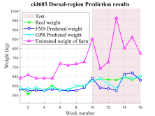
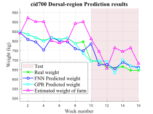

# Application of Weight Prediction for Holstein Dairy Cattle in Non-Pregnant and Postpartum Stages

This repository (Cows-Weight-Prediction) contains MATLAB code for evaluating machine learning models used in Holstein dairy cattle weight prediction research, representing part of the source code from our paper "Application of Weight Prediction for Holstein Dairy Cattle in Non-Pregnant and Postpartum Stages." The project compares the performance of Feedforward Neural Network (FNN) and Gaussian Process Regression (GPR) models against traditional farm weight estimation methods, primarily designed for testing out-of-sample data.

| Non-Pregnant cattle | Postpartum cattle |
|---------------------|-------------------|
|||

### Software Requirements
- **MATLAB**: Version R2025a or later
- **Required Toolboxes**:
  - Deep Learning Toolbox (for FNN models)
  - Statistics and Machine Learning Toolbox (for GPR models)
  - Image Processing Toolbox (for data preprocessing)

## File Structure

```
Cows-Weight-Prediction/           # This repository
├── useModel.m                    # Main evaluation script
├── README.md                     # This documentation file
├── model/
│   ├── FNNmodel.mat              # Pre-trained FNN model
│   ├── GPRmodel.mat              # Pre-trained GPR model
├── TestResults/                  # Generated results directory
│   └── [CATTLE_ID]/
│       ├── *_Prediction_Results.svg
│       ├── *_Metrics_Comparison.svg
│       └── *_TestResults.md── 
├── Dataset.mat                   
├── interpolateStructFields.m     # Data preprocessing utility
├── inpaint_nans.m
└── safeFirstElement.m
```

## Execute

### 1. Setup
```matlab
% Clone repository and navigate to project directory
cd Cows-Weight-Prediction

% Ensure all required files are present
if exist('useModel.m', 'file') && exist('TestData.mat', 'file') && exist('inpaint_nans.m', 'file') && exist('interpolateStructFields.m', 'file') && exist('safeFirstElement.m', 'file')
    fprintf('✓ All required files found\n');
else
    error('Missing required files. Please check installation.');
end
```

### 2. Configuration
Edit the configuration parameters in `useModel.m`:

```matlab
% Configuration Parameters
REGION_INDEX = 1;              % 1: Dorsal, 2: Hips, 3: Side
CATTLE_ID = "cid700";          % Available: cid111, cid514, cid603, cid660, cid700
```

### 3. Run Analysis
```matlab
% Execute the main script
run('useModel.m')
```

> [!WARNING]
> If using MATLAB versions prior to R2025a, the line `theme(fig, "light"); % MATLAB Version: 2025a` in `useModel.m` must be commented out. 

## Test Dataset Description

### Dataset Overview
The test dataset (`Dataset.mat`) contains longitudinal measurements from multiple cattle over several weeks.

### Data Structure
```matlab
Dataset.mat
├── tmpData
    ├── cid111/          % Cattle ID 1
    ├── cid514/          % Cattle ID 2  
    ├── cid603/          % Cattle ID 3
    ├── cid660/          % Cattle ID 4
    └── cid700/          % Cattle ID 5
        ├── sn299_Dorsalregion/    % Dorsal measurements
        ├── sn729_Hips/            % Hips measurements
        └── sn003_Side/            % Side measurements
```

### Feature Description
Each measurement contains 7 columns:
1. **Feature 1-5**: Morphological measurements (body dimensions in pixels/cm)
2. **Column 6**: Ground truth weight (kg) - actual measured weight
3. **Column 7**: Farm estimated weight (kg) - traditional estimation method

### Temporal Structure
- **Training Period**: Weeks 1-9 (used for model training)
- **Test Period**: Weeks 10-16 (used for evaluation)
- **Sampling Frequency**: Weekly measurements

## Output Description

### Generated Files

#### 1. Prediction Results Plot (`*_Prediction_Results.svg`)
- **Content**: Time series plot comparing all prediction methods
- **Features**: 
  - Ground truth weight (green pentagrams)
  - FNN predictions (blue circles)
  - GPR predictions (cyan circles)  
  - Farm estimations (magenta triangles)
  - Highlighted test period (weeks 10-16)

#### 2. Metrics Comparison Plot (`*_Metrics_Comparison.svg`)
- **Content**: Bar chart comparing performance metrics
- **Metrics Included**:
  - MSE (Mean Squared Error)
  - RMSE (Root Mean Squared Error)  
  - MAE (Mean Absolute Error)
  - MAPE (Mean Absolute Percentage Error)
- **Layout**: Dual y-axis (MSE on left, others on right)

#### 3. Results Summary (`*_Metrics.md`)
- **Content**: Comprehensive analysis report in Markdown format
- **Sections**:
  - Test configuration details
  - Individual model performance metrics
  - Comparative analysis
  - Embedded visualization links

## Troubleshooting

### Common Issues

#### 1. **File Not Found Errors**
```
Error: Cannot open file 'model\FNNmodel.mat'
```
**Solution**: Ensure all model files are in the correct directory structure.

#### 2. **Graphics Issues**
```
Warning: Unable to save SVG files
```
**Solution**: 
- Check write permissions in output directory
- Ensure sufficient disk space
- Update graphics drivers

#### 3. **Model Compatibility**
```
Error: Network was trained with a different version
```
**Solution**: 
- Verify MATLAB version compatibility
- Retrain models if necessary
- Check Deep Learning Toolbox version

## License

This repository is licensed under the MIT License - see the [LICENSE](LICENSE) file for details.

## Contact

For questions, issues, or collaborations:
- **Primary Contact**: wlchu@nchu.edu.tw
- **Institution**: National Chung-Hsing University, Taichung, 402202, Taiwan

