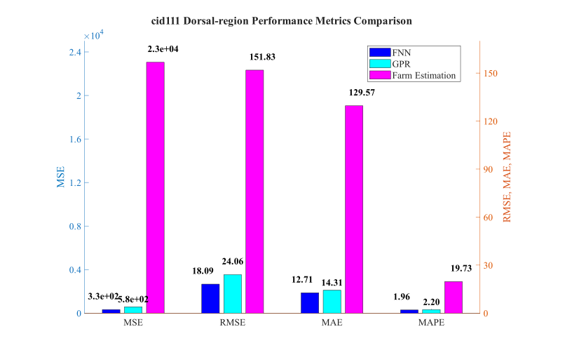
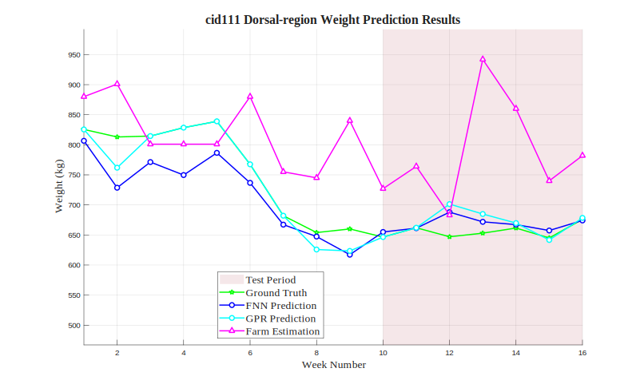

# cid111 Dorsal-region Analysis Results

## Test Configuration

- **Cattle ID**: cid111
- **Body Region**: Dorsal-region
- **Test Period**: Weeks 10-16
- **Number of Test Samples**: 7

## FNN Model Performance

- **Mean Squared Error (MSE)**: 327.2934
- **Root Mean Squared Error (RMSE)**: 18.0913 kg
- **Mean Absolute Error (MAE)**: 12.7065 kg
- **Mean Absolute Percentage Error (MAPE)**: 1.96%

## GPR Model Performance

- **Mean Squared Error (MSE)**: 578.6442
- **Root Mean Squared Error (RMSE)**: 24.0550 kg
- **Mean Absolute Error (MAE)**: 14.3098 kg
- **Mean Absolute Percentage Error (MAPE)**: 2.20%

## Farm Estimation Performance

- **Mean Squared Error (MSE)**: 23052.0714
- **Root Mean Squared Error (RMSE)**: 151.8291 kg
- **Mean Absolute Error (MAE)**: 129.5714 kg
- **Mean Absolute Percentage Error (MAPE)**: 19.73%

## Performance Comparison

## Prediction Results

