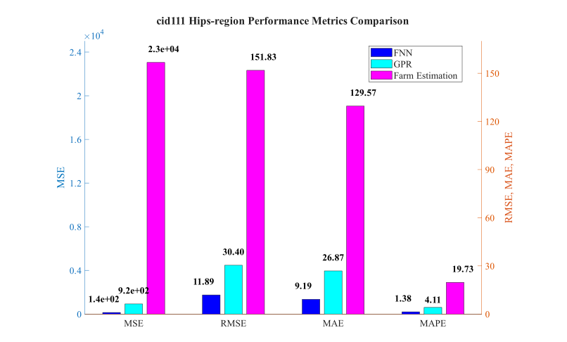
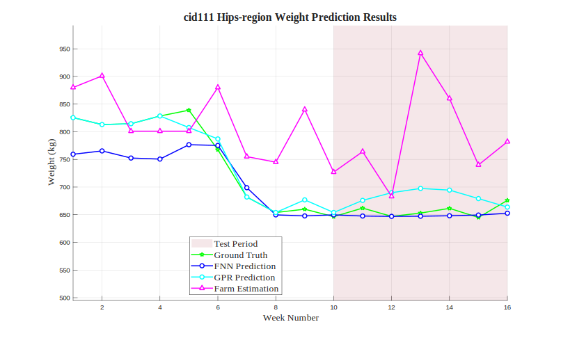

# cid111 Hips-region Analysis Results

## Test Configuration

- **Cattle ID**: cid111
- **Body Region**: Hips-region
- **Test Period**: Weeks 10-16
- **Number of Test Samples**: 7

## FNN Model Performance

- **Mean Squared Error (MSE)**: 141.3369
- **Root Mean Squared Error (RMSE)**: 11.8885 kg
- **Mean Absolute Error (MAE)**: 9.1881 kg
- **Mean Absolute Percentage Error (MAPE)**: 1.38%

## GPR Model Performance

- **Mean Squared Error (MSE)**: 924.2202
- **Root Mean Squared Error (RMSE)**: 30.4010 kg
- **Mean Absolute Error (MAE)**: 26.8749 kg
- **Mean Absolute Percentage Error (MAPE)**: 4.11%

## Farm Estimation Performance

- **Mean Squared Error (MSE)**: 23052.0714
- **Root Mean Squared Error (RMSE)**: 151.8291 kg
- **Mean Absolute Error (MAE)**: 129.5714 kg
- **Mean Absolute Percentage Error (MAPE)**: 19.73%

## Performance Comparison

## Prediction Results

