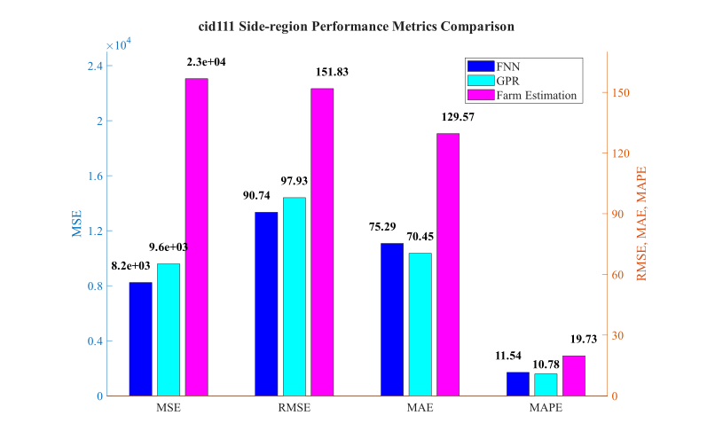
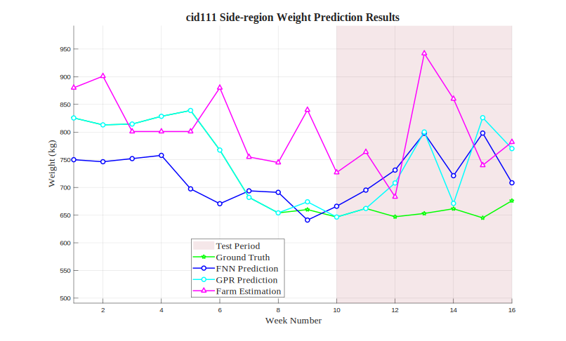

# cid111 Side-region Analysis Results

## Test Configuration

- **Cattle ID**: cid111
- **Body Region**: Side-region
- **Test Period**: Weeks 10-16
- **Number of Test Samples**: 7

## FNN Model Performance

- **Mean Squared Error (MSE)**: 8233.4336
- **Root Mean Squared Error (RMSE)**: 90.7383 kg
- **Mean Absolute Error (MAE)**: 75.2872 kg
- **Mean Absolute Percentage Error (MAPE)**: 11.54%

## GPR Model Performance

- **Mean Squared Error (MSE)**: 9589.6204
- **Root Mean Squared Error (RMSE)**: 97.9266 kg
- **Mean Absolute Error (MAE)**: 70.4462 kg
- **Mean Absolute Percentage Error (MAPE)**: 10.78%

## Farm Estimation Performance

- **Mean Squared Error (MSE)**: 23052.0714
- **Root Mean Squared Error (RMSE)**: 151.8291 kg
- **Mean Absolute Error (MAE)**: 129.5714 kg
- **Mean Absolute Percentage Error (MAPE)**: 19.73%

## Performance Comparison

## Prediction Results

