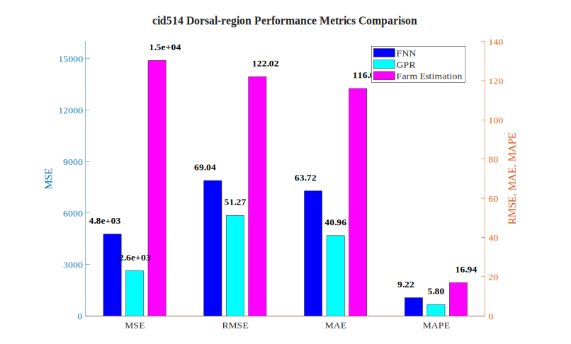
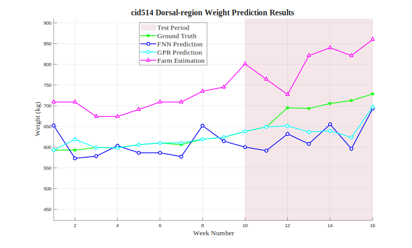

# cid514 Dorsal-region Analysis Results

## Test Configuration

- **Cattle ID**: cid514
- **Body Region**: Dorsal-region
- **Test Period**: Weeks 10-16
- **Number of Test Samples**: 7

## FNN Model Performance

- **Mean Squared Error (MSE)**: 4765.9282
- **Root Mean Squared Error (RMSE)**: 69.0357 kg
- **Mean Absolute Error (MAE)**: 63.7199 kg
- **Mean Absolute Percentage Error (MAPE)**: 9.22%

## GPR Model Performance

- **Mean Squared Error (MSE)**: 2628.7562
- **Root Mean Squared Error (RMSE)**: 51.2714 kg
- **Mean Absolute Error (MAE)**: 40.9621 kg
- **Mean Absolute Percentage Error (MAPE)**: 5.80%

## Farm Estimation Performance

- **Mean Squared Error (MSE)**: 14889.8571
- **Root Mean Squared Error (RMSE)**: 122.0240 kg
- **Mean Absolute Error (MAE)**: 116.0000 kg
- **Mean Absolute Percentage Error (MAPE)**: 16.94%

## Performance Comparison

## Prediction Results

