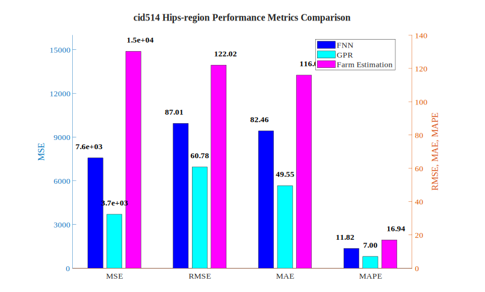
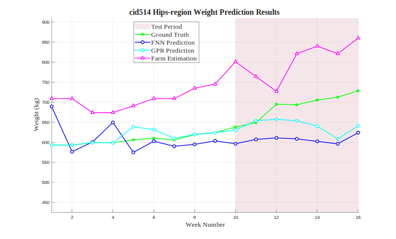

# cid514 Hips-region Analysis Results

## Test Configuration

- **Cattle ID**: cid514
- **Body Region**: Hips-region
- **Test Period**: Weeks 10-16
- **Number of Test Samples**: 7

## FNN Model Performance

- **Mean Squared Error (MSE)**: 7569.9419
- **Root Mean Squared Error (RMSE)**: 87.0054 kg
- **Mean Absolute Error (MAE)**: 82.4551 kg
- **Mean Absolute Percentage Error (MAPE)**: 11.82%

## GPR Model Performance

- **Mean Squared Error (MSE)**: 3694.6379
- **Root Mean Squared Error (RMSE)**: 60.7835 kg
- **Mean Absolute Error (MAE)**: 49.5535 kg
- **Mean Absolute Percentage Error (MAPE)**: 7.00%

## Farm Estimation Performance

- **Mean Squared Error (MSE)**: 14889.8571
- **Root Mean Squared Error (RMSE)**: 122.0240 kg
- **Mean Absolute Error (MAE)**: 116.0000 kg
- **Mean Absolute Percentage Error (MAPE)**: 16.94%

## Performance Comparison

## Prediction Results

