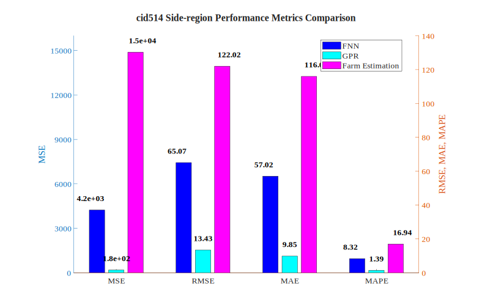
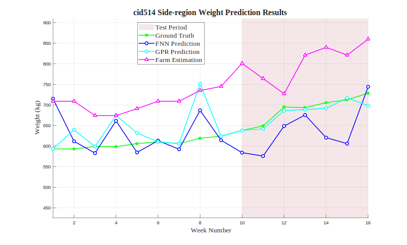

# cid514 Side-region Analysis Results

## Test Configuration

- **Cattle ID**: cid514
- **Body Region**: Side-region
- **Test Period**: Weeks 10-16
- **Number of Test Samples**: 7

## FNN Model Performance

- **Mean Squared Error (MSE)**: 4233.5425
- **Root Mean Squared Error (RMSE)**: 65.0657 kg
- **Mean Absolute Error (MAE)**: 57.0220 kg
- **Mean Absolute Percentage Error (MAPE)**: 8.32%

## GPR Model Performance

- **Mean Squared Error (MSE)**: 180.4309
- **Root Mean Squared Error (RMSE)**: 13.4325 kg
- **Mean Absolute Error (MAE)**: 9.8496 kg
- **Mean Absolute Percentage Error (MAPE)**: 1.39%

## Farm Estimation Performance

- **Mean Squared Error (MSE)**: 14889.8571
- **Root Mean Squared Error (RMSE)**: 122.0240 kg
- **Mean Absolute Error (MAE)**: 116.0000 kg
- **Mean Absolute Percentage Error (MAPE)**: 16.94%

## Performance Comparison

## Prediction Results

