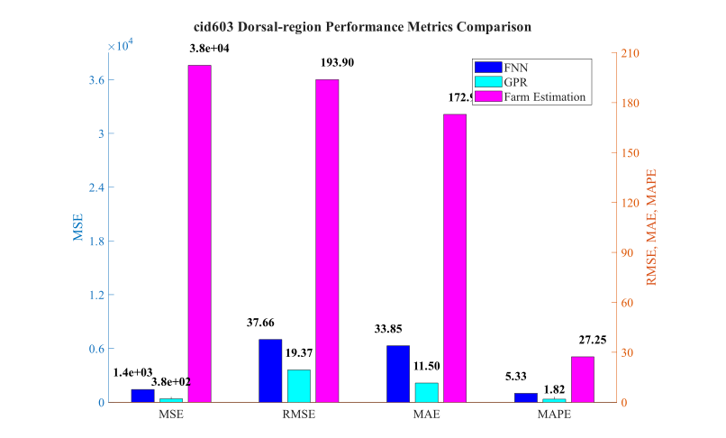
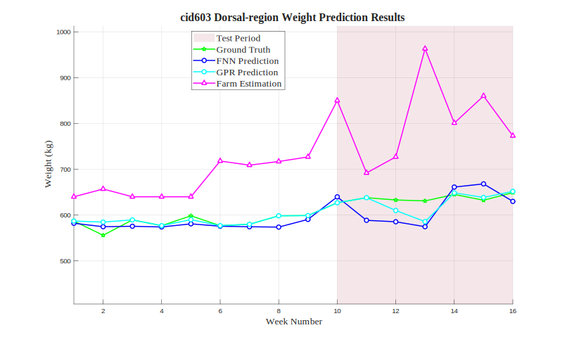

# cid603 Dorsal-region Analysis Results

## Test Configuration

- **Cattle ID**: cid603
- **Body Region**: Dorsal-region
- **Test Period**: Weeks 10-16
- **Number of Test Samples**: 7

## FNN Model Performance

- **Mean Squared Error (MSE)**: 1418.3331
- **Root Mean Squared Error (RMSE)**: 37.6608 kg
- **Mean Absolute Error (MAE)**: 33.8532 kg
- **Mean Absolute Percentage Error (MAPE)**: 5.33%

## GPR Model Performance

- **Mean Squared Error (MSE)**: 375.3436
- **Root Mean Squared Error (RMSE)**: 19.3738 kg
- **Mean Absolute Error (MAE)**: 11.4999 kg
- **Mean Absolute Percentage Error (MAPE)**: 1.82%

## Farm Estimation Performance

- **Mean Squared Error (MSE)**: 37596.1786
- **Root Mean Squared Error (RMSE)**: 193.8973 kg
- **Mean Absolute Error (MAE)**: 172.9286 kg
- **Mean Absolute Percentage Error (MAPE)**: 27.25%

## Performance Comparison

## Prediction Results

