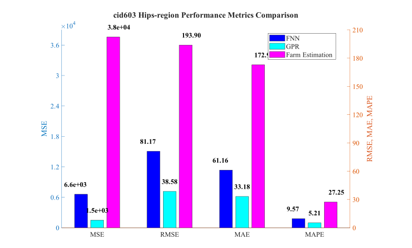

# cid603 Hips-region Analysis Results

## Test Configuration

- **Cattle ID**: cid603
- **Body Region**: Hips-region
- **Test Period**: Weeks 10-16
- **Number of Test Samples**: 7

## FNN Model Performance

- **Mean Squared Error (MSE)**: 6588.2261
- **Root Mean Squared Error (RMSE)**: 81.1679 kg
- **Mean Absolute Error (MAE)**: 61.1581 kg
- **Mean Absolute Percentage Error (MAPE)**: 9.57%

## GPR Model Performance

- **Mean Squared Error (MSE)**: 1488.2906
- **Root Mean Squared Error (RMSE)**: 38.5784 kg
- **Mean Absolute Error (MAE)**: 33.1821 kg
- **Mean Absolute Percentage Error (MAPE)**: 5.21%

## Farm Estimation Performance

- **Mean Squared Error (MSE)**: 37596.1786
- **Root Mean Squared Error (RMSE)**: 193.8973 kg
- **Mean Absolute Error (MAE)**: 172.9286 kg
- **Mean Absolute Percentage Error (MAPE)**: 27.25%

## Performance Comparison

## Prediction Results

