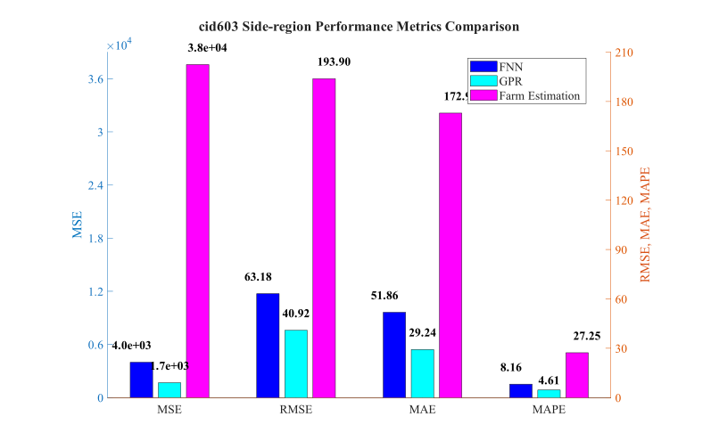
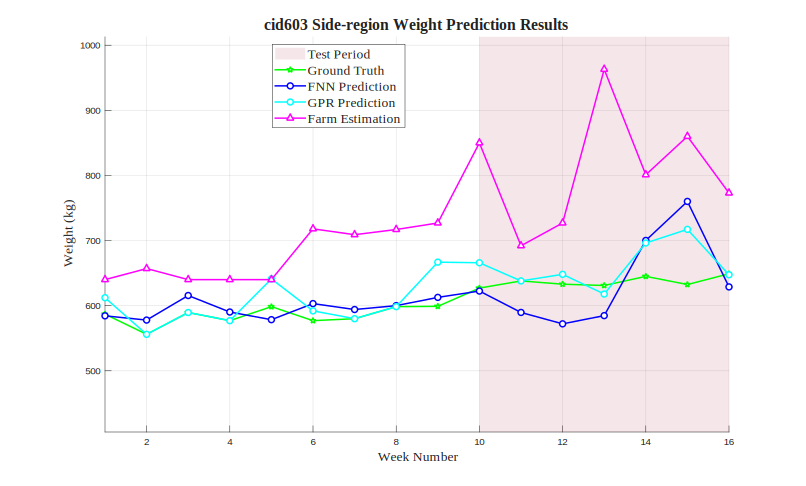

# cid603 Side-region Analysis Results

## Test Configuration

- **Cattle ID**: cid603
- **Body Region**: Side-region
- **Test Period**: Weeks 10-16
- **Number of Test Samples**: 7

## FNN Model Performance

- **Mean Squared Error (MSE)**: 3992.2522
- **Root Mean Squared Error (RMSE)**: 63.1843 kg
- **Mean Absolute Error (MAE)**: 51.8609 kg
- **Mean Absolute Percentage Error (MAPE)**: 8.16%

## GPR Model Performance

- **Mean Squared Error (MSE)**: 1674.4423
- **Root Mean Squared Error (RMSE)**: 40.9200 kg
- **Mean Absolute Error (MAE)**: 29.2404 kg
- **Mean Absolute Percentage Error (MAPE)**: 4.61%

## Farm Estimation Performance

- **Mean Squared Error (MSE)**: 37596.1786
- **Root Mean Squared Error (RMSE)**: 193.8973 kg
- **Mean Absolute Error (MAE)**: 172.9286 kg
- **Mean Absolute Percentage Error (MAPE)**: 27.25%

## Performance Comparison

## Prediction Results

