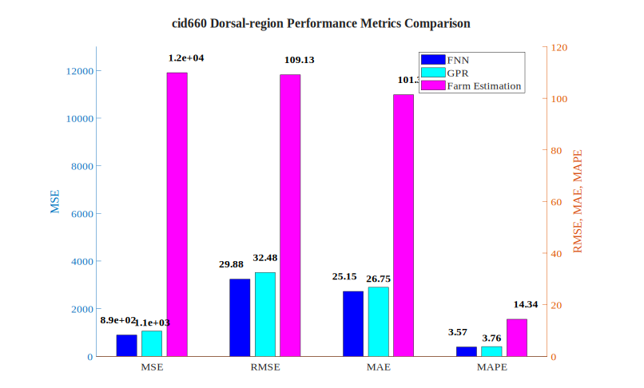

# cid660 Dorsal-region Analysis Results

## Test Configuration

- **Cattle ID**: cid660
- **Body Region**: Dorsal-region
- **Test Period**: Weeks 10-16
- **Number of Test Samples**: 7

## FNN Model Performance

- **Mean Squared Error (MSE)**: 892.6830
- **Root Mean Squared Error (RMSE)**: 29.8778 kg
- **Mean Absolute Error (MAE)**: 25.1476 kg
- **Mean Absolute Percentage Error (MAPE)**: 3.57%

## GPR Model Performance

- **Mean Squared Error (MSE)**: 1054.7719
- **Root Mean Squared Error (RMSE)**: 32.4773 kg
- **Mean Absolute Error (MAE)**: 26.7455 kg
- **Mean Absolute Percentage Error (MAPE)**: 3.76%

## Farm Estimation Performance

- **Mean Squared Error (MSE)**: 11908.6071
- **Root Mean Squared Error (RMSE)**: 109.1266 kg
- **Mean Absolute Error (MAE)**: 101.3571 kg
- **Mean Absolute Percentage Error (MAPE)**: 14.34%

## Performance Comparison

## Prediction Results

