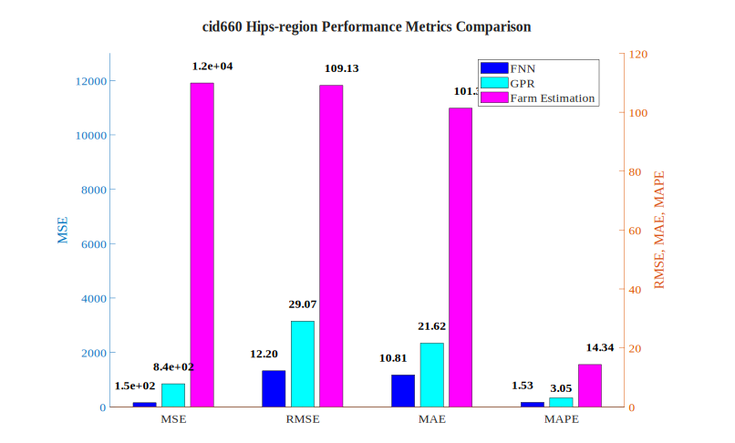
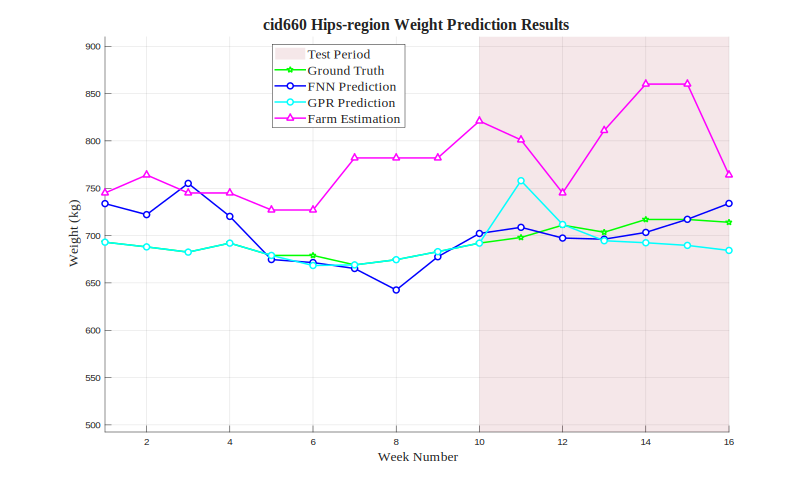

# cid660 Hips-region Analysis Results

## Test Configuration

- **Cattle ID**: cid660
- **Body Region**: Hips-region
- **Test Period**: Weeks 10-16
- **Number of Test Samples**: 7

## FNN Model Performance

- **Mean Squared Error (MSE)**: 148.9586
- **Root Mean Squared Error (RMSE)**: 12.2049 kg
- **Mean Absolute Error (MAE)**: 10.8060 kg
- **Mean Absolute Percentage Error (MAPE)**: 1.53%

## GPR Model Performance

- **Mean Squared Error (MSE)**: 844.8767
- **Root Mean Squared Error (RMSE)**: 29.0668 kg
- **Mean Absolute Error (MAE)**: 21.6234 kg
- **Mean Absolute Percentage Error (MAPE)**: 3.05%

## Farm Estimation Performance

- **Mean Squared Error (MSE)**: 11908.6071
- **Root Mean Squared Error (RMSE)**: 109.1266 kg
- **Mean Absolute Error (MAE)**: 101.3571 kg
- **Mean Absolute Percentage Error (MAPE)**: 14.34%

## Performance Comparison

## Prediction Results

