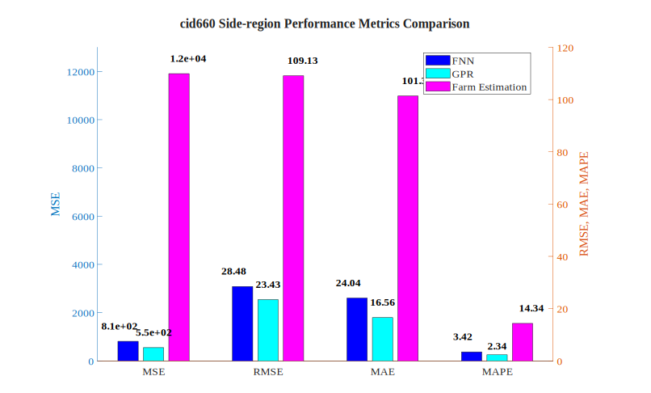
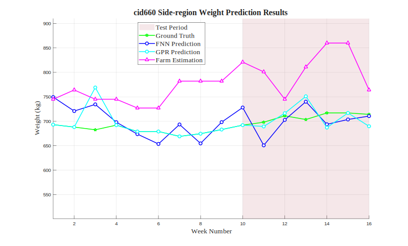

# cid660 Side-region Analysis Results

## Test Configuration

- **Cattle ID**: cid660
- **Body Region**: Side-region
- **Test Period**: Weeks 10-16
- **Number of Test Samples**: 7

## FNN Model Performance

- **Mean Squared Error (MSE)**: 811.0539
- **Root Mean Squared Error (RMSE)**: 28.4790 kg
- **Mean Absolute Error (MAE)**: 24.0445 kg
- **Mean Absolute Percentage Error (MAPE)**: 3.42%

## GPR Model Performance

- **Mean Squared Error (MSE)**: 549.1568
- **Root Mean Squared Error (RMSE)**: 23.4341 kg
- **Mean Absolute Error (MAE)**: 16.5589 kg
- **Mean Absolute Percentage Error (MAPE)**: 2.34%

## Farm Estimation Performance

- **Mean Squared Error (MSE)**: 11908.6071
- **Root Mean Squared Error (RMSE)**: 109.1266 kg
- **Mean Absolute Error (MAE)**: 101.3571 kg
- **Mean Absolute Percentage Error (MAPE)**: 14.34%

## Performance Comparison

## Prediction Results

