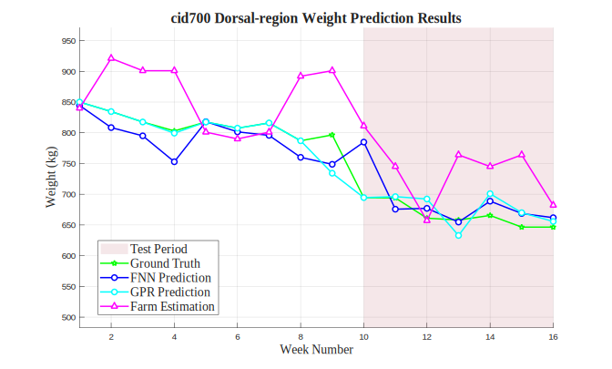

# cid700 Dorsal-region Analysis Results

## Test Configuration

- **Cattle ID**: cid700
- **Body Region**: Dorsal-region
- **Test Period**: Weeks 10-16
- **Number of Test Samples**: 7

## FNN Model Performance

- **Mean Squared Error (MSE)**: 1432.7119
- **Root Mean Squared Error (RMSE)**: 37.8512 kg
- **Mean Absolute Error (MAE)**: 26.9535 kg
- **Mean Absolute Percentage Error (MAPE)**: 3.98%

## GPR Model Performance

- **Mean Squared Error (MSE)**: 499.3426
- **Root Mean Squared Error (RMSE)**: 22.3460 kg
- **Mean Absolute Error (MAE)**: 18.0587 kg
- **Mean Absolute Percentage Error (MAPE)**: 2.74%

## Farm Estimation Performance

- **Mean Squared Error (MSE)**: 6973.1429
- **Root Mean Squared Error (RMSE)**: 83.5053 kg
- **Mean Absolute Error (MAE)**: 72.8571 kg
- **Mean Absolute Percentage Error (MAPE)**: 10.92%

## Performance Comparison

## Prediction Results

