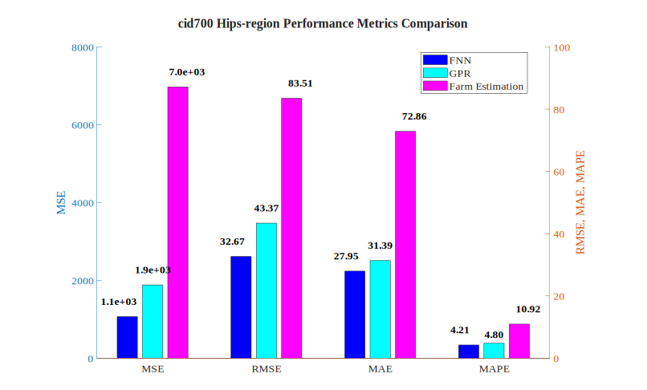
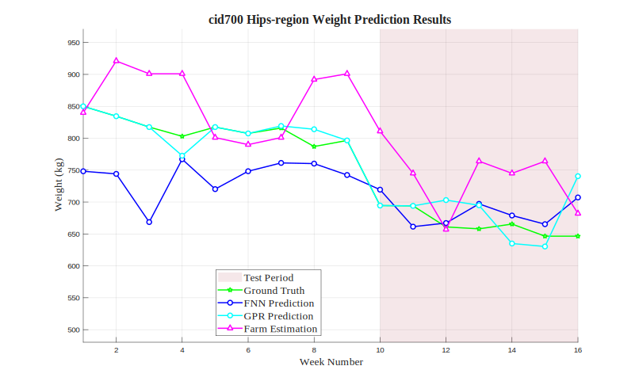

# cid700 Hips-region Analysis Results

## Test Configuration

- **Cattle ID**: cid700
- **Body Region**: Hips-region
- **Test Period**: Weeks 10-16
- **Number of Test Samples**: 7

## FNN Model Performance

- **Mean Squared Error (MSE)**: 1067.0087
- **Root Mean Squared Error (RMSE)**: 32.6651 kg
- **Mean Absolute Error (MAE)**: 27.9485 kg
- **Mean Absolute Percentage Error (MAPE)**: 4.21%

## GPR Model Performance

- **Mean Squared Error (MSE)**: 1880.9822
- **Root Mean Squared Error (RMSE)**: 43.3703 kg
- **Mean Absolute Error (MAE)**: 31.3851 kg
- **Mean Absolute Percentage Error (MAPE)**: 4.80%

## Farm Estimation Performance

- **Mean Squared Error (MSE)**: 6973.1429
- **Root Mean Squared Error (RMSE)**: 83.5053 kg
- **Mean Absolute Error (MAE)**: 72.8571 kg
- **Mean Absolute Percentage Error (MAPE)**: 10.92%

## Performance Comparison

## Prediction Results

