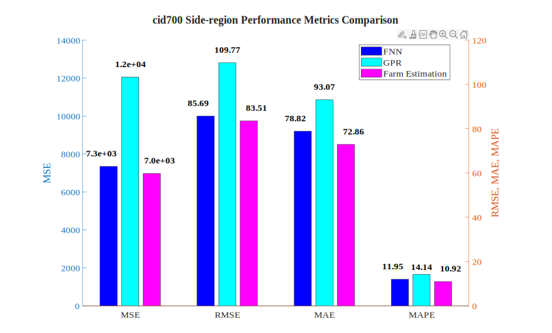
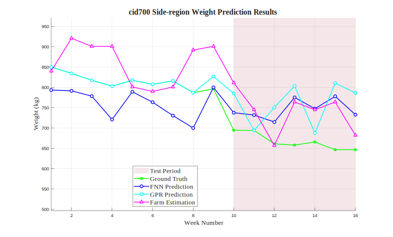

# cid700 Side-region Analysis Results

## Test Configuration

- **Cattle ID**: cid700
- **Body Region**: Side-region
- **Test Period**: Weeks 10-16
- **Number of Test Samples**: 7

## FNN Model Performance

- **Mean Squared Error (MSE)**: 7342.4302
- **Root Mean Squared Error (RMSE)**: 85.6880 kg
- **Mean Absolute Error (MAE)**: 78.8227 kg
- **Mean Absolute Percentage Error (MAPE)**: 11.95%

## GPR Model Performance

- **Mean Squared Error (MSE)**: 12048.9550
- **Root Mean Squared Error (RMSE)**: 109.7677 kg
- **Mean Absolute Error (MAE)**: 93.0731 kg
- **Mean Absolute Percentage Error (MAPE)**: 14.14%

## Farm Estimation Performance

- **Mean Squared Error (MSE)**: 6973.1429
- **Root Mean Squared Error (RMSE)**: 83.5053 kg
- **Mean Absolute Error (MAE)**: 72.8571 kg
- **Mean Absolute Percentage Error (MAPE)**: 10.92%

## Performance Comparison

## Prediction Results

